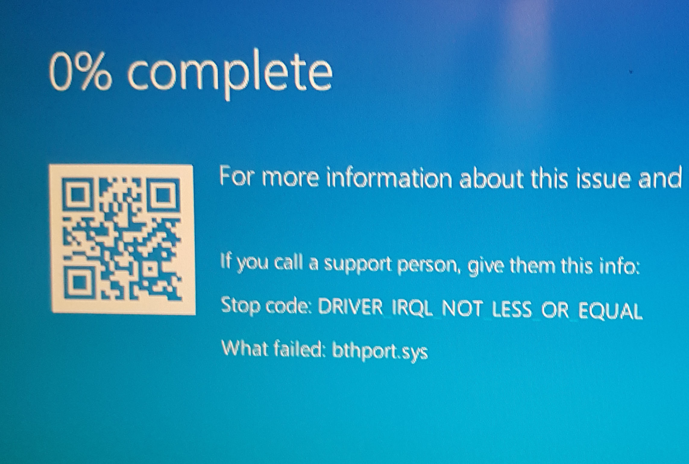

Special thanks to Richard Perry from GreyCube.com for WiiBalanceWalker

# Wii Balance Board GUI
## A fork of the lost WiiBalanceWalker with a new GUI

Download Wii Balance Board GUI from the [releases](https://github.com/TheOneTrueCode/Wii-Balance-Board-GUI/releases "WBBGUI download").

## Prerequisites

* A 32 bit x86 or compatible computer running *Microsoft Windows 7* or [later](https://www.microsoft.com/en-ca/software-download/windows10)
* Microsoft *.NET Framework* 4.5 or [later](https://www.microsoft.com/en-us/download/confirmation.aspx?id=55170)
* A working compatible *Bluetooth Transciever* 
* A Nintendo *Wii Fit Balance Board*

## Setup

1. Download Wii Balance Board GUI to your prefered location from [here](https://github.com/TheOneTrueCode/Wii-Balance-Board-GUI/releases "WBBGUI download")
2. Run ***WBBGUI.exe***

## Connecting to the Balance Board

1. Click ***Pair Device(s)***

2. Click ***Pair***

3. Hold down the ***Sync*** button on your *Wii Fit Balance Board* located in the battery bay and *try not to let go*

  * The window will briefly stop responding, this is normal

4. If sucessful, click ***Connect Paired Board*** while *still holding the Sync button* 

  * If unsucessfull, ***do not click pair again***. Re-start the program and go to step 1, failiure to do so may result in a *BSOD*

  
  * If it continues to be unsucessful, navigate to ***Control Panel\All Control Panel Items\Devices and Printers*** and select ***Add a device***, then pair from there
  
5. *WBBGUI* will now hide in the system tray (it may be hidden under the ^ button)

6. Right click the icon in the system tray and click ***Show***

*  Here you can see the debug information and keymappings

 
